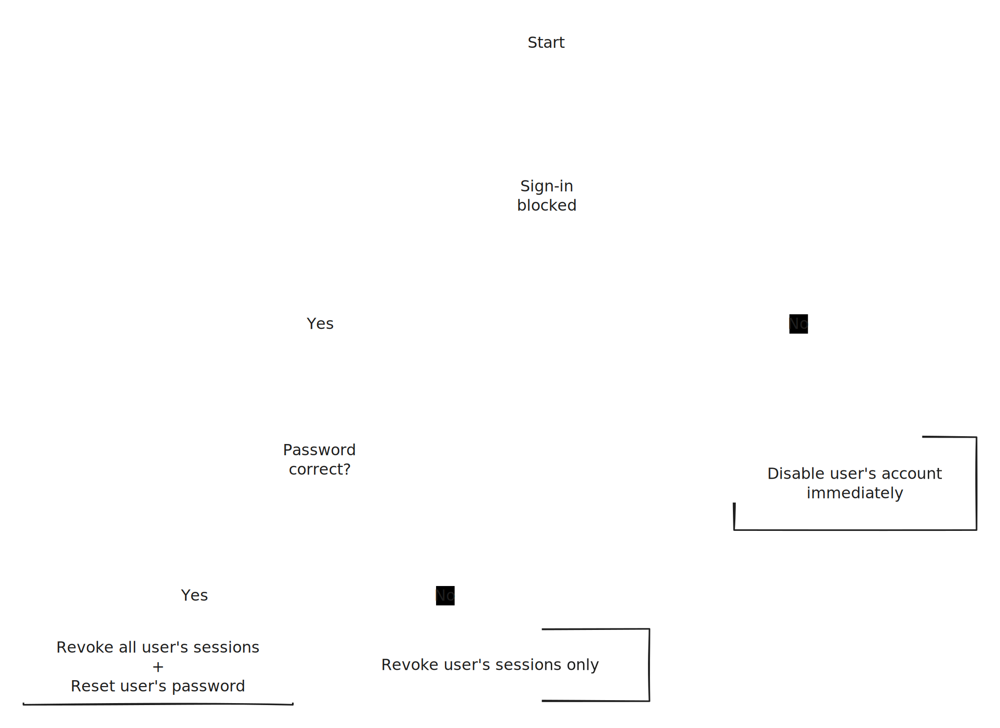

# Unfamiliar sign-in properties

### Alert Details:

#### Explanation:&#x20;

The alert comes from Microsoft Defender for Identity. It triggers when a sign-in property is not usually seen before compared to the baseline of the user's sign-in behaviour.

For example, if a user is used to login from a certain device and suddenly this time he sign-in from a different device. This is considered as an "unfamiliar" sign-in property. Since this sign-in doesn't align with his history sign-in patterns, It will trigger an alert.

This is a list of different sign-in properties that Defender checks for unfamiliarity:

* IP
* Location
* Device
* Browser
* ASN
* Tenant IP subnet

> **How does Defender really knows that a sign-in property is unfamiliar?**&#x20;
>
> When a user is created, he enters a "learning mode" period to define his sign-in baseline. During this period (minimum 5 days), this alert is disabled and the Machine Learning model learns the sign-in patterns of this user until it is capable of determining what sign-in properties lead to a risky sign-in.
>
> Once the model is capable of distinguishing between risky and not risky, the alert will be turned on
>
> P.S: a long period of inactivity, can reset the baseline and put the user back to "learning mode"&#x20;


#### Impact:&#x20;

* Lateral mouvement attack through cloud services (Teams, Sharepoint...)

### IOCs and valuable infos:

*
*

### Queries used:

* This query is used to detect recent unfamiliar sign-in properties and join them with the user's information and see if the sign in is blocked+reason and if password entered is correct an

```
```


### Actions taken to mitigate the threat:




### Threat Huting

* Query to display all risky sign-ins (unfamiliar) from users without MFA enables

```
```

* Query to show details about the users who had a "correct password" for a sign-in with unfamiliar sign-in properties

```
```

