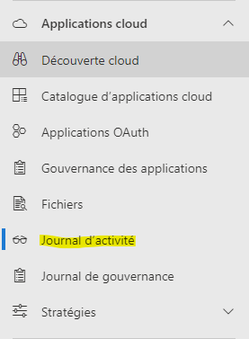

# New executable via Office FileUploaded Operation

### Alert Details:

#### Explanation:&#x20;

This alert trigers when a user upload a file that contains file extensions of an executable (.exe, .cmd, .bat...) to Office services (Onedrive, Sharepoint, etc...).

Identifies when executable file types are uploaded to Office services such as SharePoint and OneDrive. List currently includes 'exe', 'inf', 'gzip', 'cmd', 'bat' file extensions. Additionally, identifies when a given user is uploading these files to another users workspace.

#### Impact \["T1105","T1570"]:&#x20;

* **Data Exfiltration:**  Uploading executable files to another user's workspace could be a sign of insider threat and the executable could establish a communication with a C2 server to extfitrate sensitive files
* **Lateral movement**: uploading a malicious file through cloud services could lead other users to download it and get compromised allowing the threat actor to move laterally in the environment.
* **Ransomeware Deployment**

### IOCs and valuable infos:

* Files uploaded
* To which office365 app it was uploaded to (Teams, OneDrive, Sharepoint...)
* Users who uploaded the files
* Users who downloaded the files

1. Go to Journal d'activité

<figure><figcaption></figcaption></figure>


2. Advanced filter:

<figure><figcaption></figcaption></figure>

3. Type the name of the file here:

<figure><figcaption></figcaption></figure>

4. Tick the box of the file and click "Finish"
5. All activities related to this specific file will be displayed

### Queries used:

* Query to display all office365 activities (upload, download..) with relevant informations regarding a <mark style="color:blue;">**specific file**</mark>:

```
CloudAppEvents
| where ObjectName endswith "file_name"
| extend AppDisplayName = parse_json(RawEventData["ApplicationDisplayName"]),
         username = parse_json(RawEventData["UserId"]),
         filename = parse_json(RawEventData["SourceFileName"])
| project TimeGenerated, AppDisplayName, File_path=ObjectName, ActionType, username, IPAddress, RawEventData
```


### Actions taken to mitigate the threat:

* Quarantine/Delete the file from Defender for cloud


### Threat hunting queries:

* Query to display infos regarding uploaded then downloaded executable files:

```
CloudAppEvents
|where RawEventData["SourceFileExtension"] has_any (dynamic(['exe', 'inf', 'gzip', 'cmd', 'bat','msi','elf','sh','bin','dmg','apk','vbs'])) and ActionType in ("FileUploaded","FileDownloaded")
| extend AppDisplayName = parse_json(RawEventData["ApplicationDisplayName"]),
         username = parse_json(RawEventData["UserId"]),
         filename = parse_json(RawEventData["SourceFileName"])
| summarize by TimeGenerated, tostring(AppDisplayName), File_path=ObjectName, tostring(filename), ActionType, tostring(username), IPAddress
```


